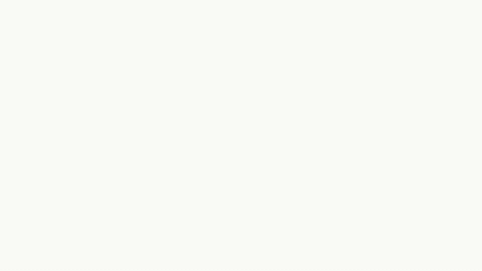
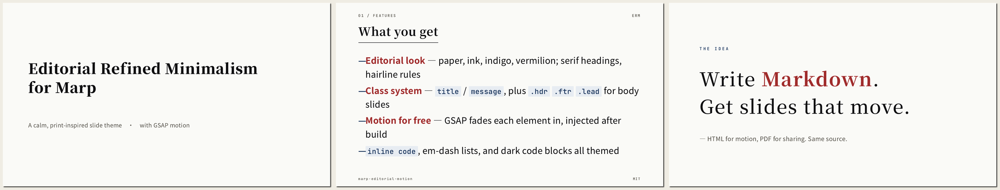

# Editorial Refined Minimalism

**動く [Marp](https://marp.app/) テーマ。**
Markdown を書くだけで、ブラウザでなめらかにフェードインする（GSAP）落ち着いたエディトリアル調のスライドと、きれいな静的 PDF が **同じ原稿から** 手に入ります。

[](LICENSE)




<sub>表紙 → メッセージ → 本文を 1 枚ずつ送り、各スライドで**要素が順にフェードイン**します（ブラウザで開いた HTML の実際の動き）。PDF は静的に書き出し——原稿は共通。</sub>

- 🎨 **エディトリアルな見た目** — 紙 / 墨 / 藍 / 朱、明朝の見出し、ヘアライン罫、モノスペースのページ番号、整った表組み、付録レイアウト
- 🎬 **モーション標準装備** — ビルド後の HTML に GSAP の entrance アニメを注入（PDF は静的のまま）
- 🧩 **クラス体系** — `title` / `message` レイアウト、本文用の `.hdr` / `.ftr` / `.lead`、表・`appendix` にも対応
- 🔧 **1 ファイルで再配色** — `theme.css` の `:root` を数行変えるだけで全スライドが追従
- 🪶 **自己完結** — Marp 組み込みの `default` テーマを `@import 'default';` で継承。フォントは Google Fonts、GSAP は CDN から


<sub>組み込みレイアウトの一部：表紙（title）・本文（hdr/ftr 付き）・メッセージ（message）。</sub>

---

## 「ビルドして」で完結（Codex / Claude Code スキル）

このリポは **Agent Skill** を同梱しているので、AI コーディングエージェントに *「ビルドして」* と言うだけでビルドできます：

- **Codex** は `.agents/skills/build-slides/SKILL.md` を読みます
- **Claude Code** は `.claude/skills/build-slides/SKILL.md` を読みます

どちらかでプロジェクトを開き、「ビルドして」「プレビューして」「配色を変えて」と頼めば、スキルが `node build.mjs` を実行します（**Windows でもそのまま動き**、bash スクリプトには手を出しません）。両ファイルは同じ Agent Skills 形式（`name` + `description` のフロントマター）です。

---

## クイックスタート

必要なのは **Node.js だけ**。`bash` も `python` も要りません——ビルドは Node スクリプト 1 本で、**Windows (PowerShell) / macOS / Linux / WSL で同じように動きます**。

```bash
git clone https://github.com/CaCC-Lab/marp-editorial-motion.git
cd marp-editorial-motion

# サンプルをビルド（PDF ＋ アニメ HTML）— どの OS でも同じ
node build.mjs examples/slides.md
```

自分のファイルを指定：

```bash
node build.mjs path/to/your-slides.md
```

> macOS / Linux / WSL では `bash build_slides.sh <file>` でも可（中身は `node build.mjs` を呼ぶだけ）。**Windows では `node build.mjs` を使ってください**（bash がありません）。
> 生成された `*.html` をブラウザで開くとアニメ版、`*.pdf` は静的な書き出しです。

自分の Markdown はこの最小フロントマターだけ——**CSS は書きません**（見た目はテーマが持ちます）：

```markdown
---
marp: true
size: 16:9
paginate: false
theme: erm
---

<!-- _class: title -->

# タイトル

<div class="meta">日付 · 名前</div>
```

---

## クラス体系

| スライド / 要素 | 使い方 |
|---|---|
| **表紙（title）** | `<!-- _class: title -->` ＋ `# 見出し` ＋ `<div class="meta">…</div>` |
| **メッセージ（message）** | `<!-- _class: message -->` ＋ `.kicker` / `.credo`（強調は `.em`）/ `.tail` |
| **本文のヘッダ/フッタ** | `<div class="hdr"><span>01 / SECTION</span><span>LABEL</span></div>` と `<div class="ftr">…</div>` |
| **リード文** | `<div class="lead">…</div>`（`small` を足すと小さく淡い注記に） |
| **表** | 素の Markdown 表が整形されます（モノスペース大文字の見出し＋ヘアライン罫） |
| **付録スライド** | `<!-- _class: appendix -->` で密度の高いレイアウト（コード・リードが小さめ） |
| **強調** | `**太字**` で朱色。`<div>` の中では `<strong>` を使う |

動くサンプルは [`examples/slides.md`](examples/slides.md) を参照。

---

## カスタマイズ（自分のブランドに）

見た目はすべて `theme.css` にあります。入口は `:root` ブロックです：

```css
:root {
  --ink:    #0e0e10;   /* 本文の文字色 */
  --paper:  #fafaf7;   /* 背景 */
  --accent: #1B365D;   /* 藍：小見出し・罫線・コード */
  --strike: #A02C2C;   /* 朱：強い強調 */

  --fs-body: 26pt;     /* 本文サイズ。切れる時はここを数 pt 動かす */
  --fs-h1:   52pt;     /* 見出しサイズ */
  /* …各テキスト役割ごとに --fs-* トークンあり */
}
```

これらのトークンを変えるだけで **全スライドが一斉に変わります**。フォントを変えるときは `theme.css` 冒頭の `@import url(...)` と、`section` / `h1, h2` の `font-family` を差し替えます。

見た目（`theme.css`）と中身（`slides.md`）が **別ファイル** なので、一度テーマを自分のブランドに育てれば、次からは中身だけ書けば完成です。

---

## 仕組み

```
your.md  ──┐        node build.mjs
           ├─→  marp-cli --theme theme.css  ─→  your.pdf + your.html
theme.css ─┘                                          │
                                       GSAP <script> を追記 ─→ アニメ HTML
```

- `theme.css` — 見た目。`/* @theme erm */` で組み込み `default` テーマを継承した Marp カスタムテーマ。
- `build.mjs` — ビルド本体＋モーション。Marp（PDF / HTML）を実行し、HTML の `</body>` 直前に `MutationObserver` ＋ GSAP の `<script>` を追記して、各スライドの要素を表示時にフェードインさせる。冪等で PDF は触りません。**純 Node なのでどの OS でも同じ**。

---

## プレビューの再生成

`examples/preview.gif` は、**ポーズした GSAP タイムラインを progress 0→1 で送りながら 1 コマずつ撮影**し（実時間録画ではないので決定論的）、3 ページ（`"1,2,3"`）を順に送って作っています。要素ごとのフェードインがそのまま記録されます：

```bash
npm i -D playwright            # 初回のみ
node build.mjs examples/slides.md
node scripts/capture_preview.js examples/slides.html /tmp/frames "1,2,3" 20 8
ffmpeg -y -framerate 25 -i /tmp/frames/f_%03d.png \
  -vf "scale=960:-1:flags=lanczos,palettegen=stats_mode=diff" /tmp/pal.png
ffmpeg -y -framerate 25 -i /tmp/frames/f_%03d.png -i /tmp/pal.png \
  -lavfi "scale=960:-1:flags=lanczos[x];[x][1:v]paletteuse=dither=bayer:bayer_scale=3" \
  examples/preview.gif
```

---

## ライセンス・クレジット

- **コード＆テーマ**：[MIT](LICENSE)。自由に使って、fork して、配ってください。
- **フォント**：Noto Serif JP / Noto Sans JP / JetBrains Mono — Google Fonts から読み込み（SIL Open Font License）。同梱はしていません。
- **GSAP**：CDN から読み込み（同梱・再配布なし）。各自のライセンスに従ってください。

無保証・ベストエフォートで提供します。Issue / PR は歓迎しますが、手厚いサポートはお約束できません。
